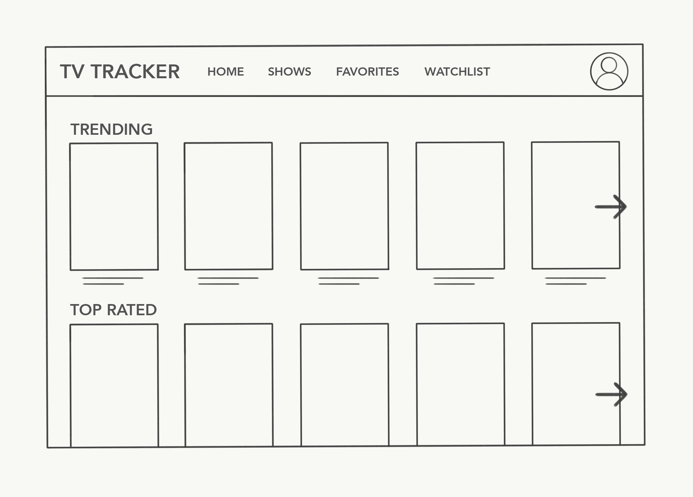
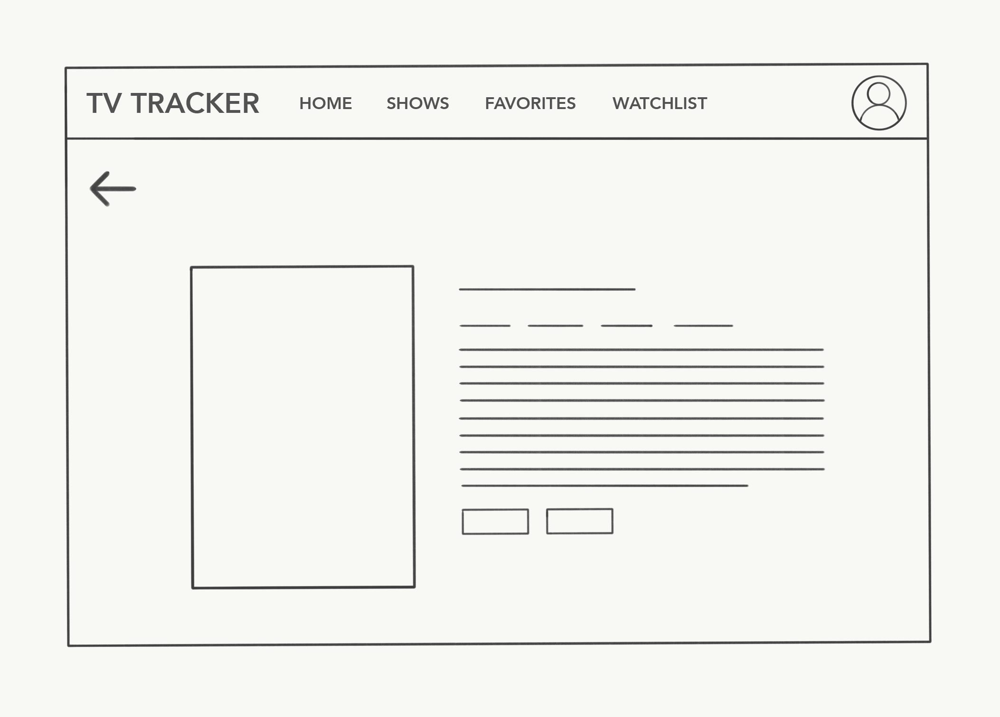
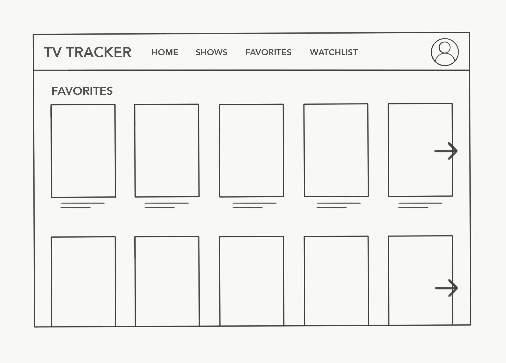
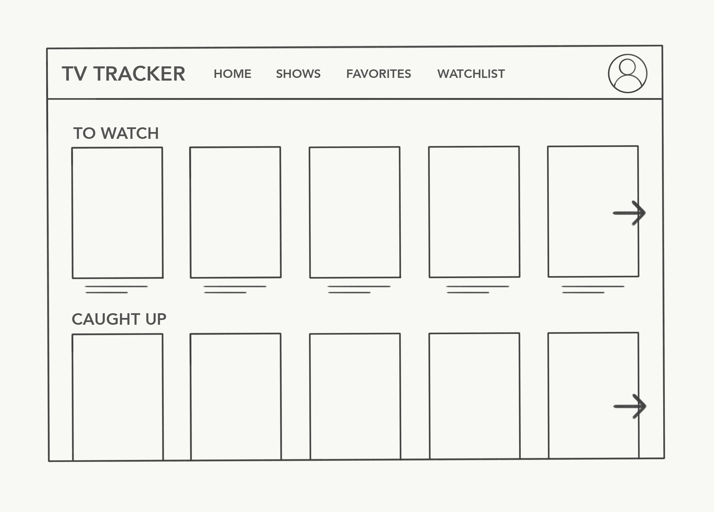
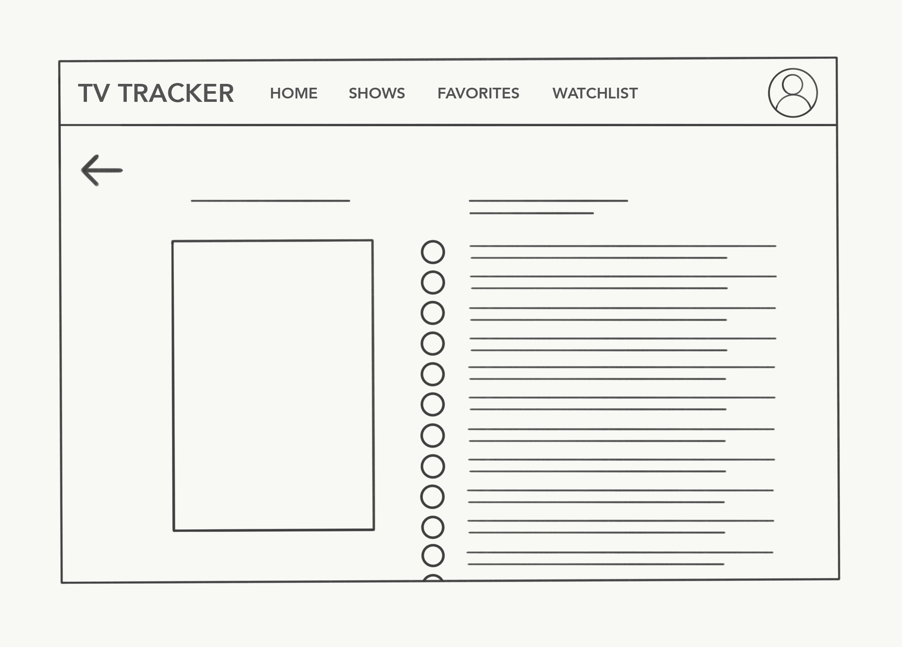

# Project 2: TV Tracker App

### Project Description:
Next Episode (still playing around with the name!) is an app that allows users to browse, track, and favorite TV shows all in one place. Using TMDb's (The Movie Database) API, users can stay up to date on all the latest information about the shows that they love, read up on episode summaries, and discover new shows.

## Wireframes:
    

## User Stories:
#### Tracking related:
- "As an avid TV-show-watcher, I want to	keep track of the many shows I watch, so I can keep up to date and not fall behind."
- "As a forgetful user, I want to be notified when my favorite shows air, so I can remember to watch them."
- "As a visual user, I want to see the tv posters of different TV shows, so I can better decide whether I want to watch the show or not."
- "As an organized user, I want to see upcoming episodes for the week, so I know which days my shows will be coming out."
- "As a lover of live TV, I want to	know when my favorite shows are airing, so I know when to tune in to watch them live."

#### API related:
- "As an in-the-know user, I want to know what the newest and most popular TV shows are, so I can be the first to tell my friends."
- "As a snobby user,	I want to watch TV shows that have been nominated for an award (Emmy, Golden Golden Globes, etc."), so I can watch critically acclaimed shows."
- "As a celebrity fan, I want to be able to sort shows by actor, so I can watch shows with characters played by my favorite actors."
- "As a forgetful user, I want to read episode summaries, so I can make sure I'm watching the right episode when I forget where I left off."
- "As a dedicated TV enthusiast, I want to know when the next season of my favorite shows are announced, so I don't have to be in the dark about whether the show will be renewed or not."
- "As a parent, I want to look up the maturity rating for different shows, so I know whether to let my kids watch a show or not."
- "As a user with multiple streaming accounts, I want to know what shows are available on which streaming site, so I know where to find the show I want to watch."
- "As a snobby user, I want to see the IMDb and Rotten Tomatoes rating, so I can watch critically acclaimed shows."

#### Recommendation related:
- "As a bored user, I want to	have a list of TV shows currently airing, so that I can have something to watch right now."
- "As a seen-it-all user, I want to find new shows to watch, so I can broaden my watchlist."
- "As an indecisive user, I want to have shows suggested to me that match my interests, so I don't have to spend so much time trying to choose what to watch."
- "As a crowd-follower, I want to see what the trending/most popular shows are, so I can know what show everyone else is talking about."

#### Auth related:
- "As a returning user, I want to log in and favorite the shows that I watch, so I can easily come back and see information about them."
- "As a serial binge-watcher, I want to keep track of what episode/season I'm on, so when I start watching I know exactly which episode to start next."


## Technologies, APIs, Modules Used:
- The Movie Database (TMDb) API - The Movie Database (TMDb) is a community built movie and TV database. TMDb has 383,412 movies, 72,667 TV shows, 1,092,166 people, 1,838,522 images, with 270,465 edits last week. Lots of information about TV/movies!
- Modules:
  - body-parser - a body parsing middleware that allows you to use `request.body`. With body-parser we can grab the body of the HTTP request.
  - method-override - allows you to use HTTP methods like `PUT` and `DELETE` in places where is usually isn't supported.
  - express-session - allows for session storage. This means that things like authentication, ids, etc. can be stored in a certain session.
  - bcrypt - a library that hashes passwords. This allows you to store an encrypted password in your database, and not a plain text one, by salting and hashing the password entered by the user. In our case, we just generated a salt and hard coded it.
  - isomorphic-fetch - allows you to `fetch()` in node, even though `fetch()` is usually only available in the browser. isomorphic-fetch allowed me to `fetch()` from APIs on the server side and not just client side.

## Code Snippet:
Using `Promise.all()` to make multiple fetches in one request, and still return one response.
```
// HOME
// -----------------------------------------------------------------------
// Display trending, popular, and airing today
app.get('/', (request, response) => {
  // Fetch most popular shows
  const getPopular = fetch('https://api.themoviedb.org/3/tv/popular?api_key=085991675705d18c9d1f19c89cae4e50&language=en-US')
    .then(popularData => popularData.json());
  // Fetch top rated shows
  const getTop = fetch('https://api.themoviedb.org/3/tv/top_rated?api_key=085991675705d18c9d1f19c89cae4e50&language=en-US')
    .then(topData => topData.json());
  // Fetch shows airing today
  const getToday = fetch('https://api.themoviedb.org/3/tv/airing_today?api_key=085991675705d18c9d1f19c89cae4e50&language=en-US')
    .then(airingData => airingData.json());
  // Resolve all promises
  Promise.all([getPopular, getTop, getToday])
    .then(homepageData => {
      // Render data from each fetch onto the page
      response.render('home', {
        popularData: homepageData[0],
        topData: homepageData[1],
        airingData: homepageData[2],
        message: ''
      })
    })
    .catch(error => {
      response.send(`Error: ${error.message}`);
    })
})
```

## Future Additions:
- Instead of having both add and remove buttons, have one button that changes depending on whether the show is in the user's favorites or not.
- I initially wanted to make a TV watch list, where the user could tick off and track their watch progress of a show, but the favorites page took a little longer to figure out and I didn't get to it.
- I wanted to give an alert message to the user of what was just added/deleted from their favorites. Right now I can only see that in the console.
- Adding some kind of confirm password feature when signing up.

## Instructions for Downloading/Running:
- Run `psql -f database/schema.sql` to get the database, and from there you can go to your browser and go to `localhost:3000/signup` to create an account.
