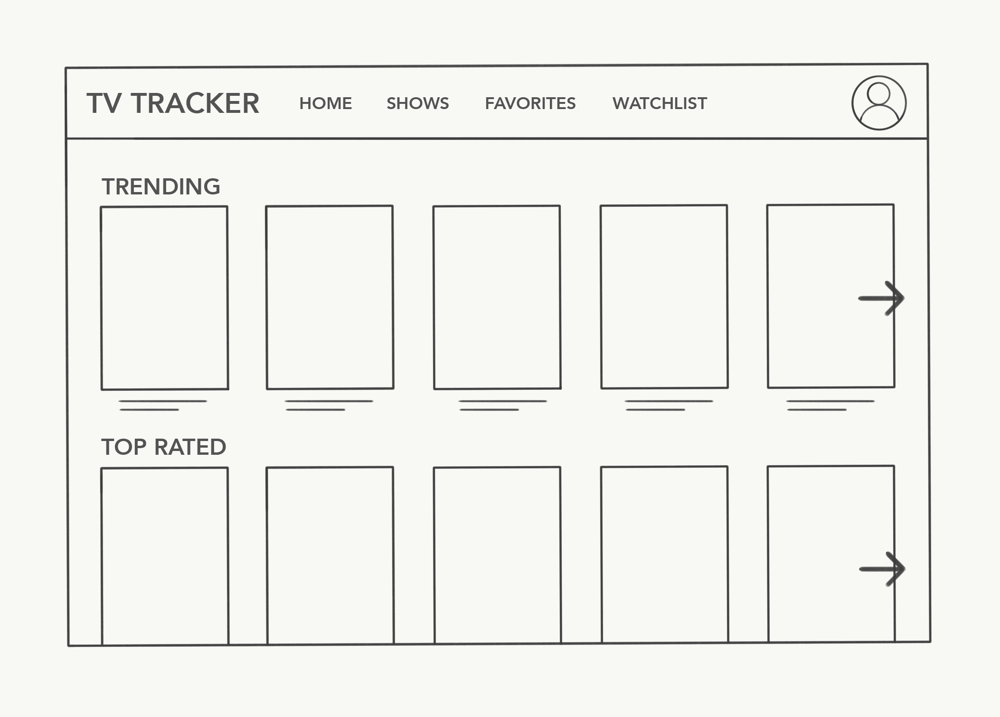
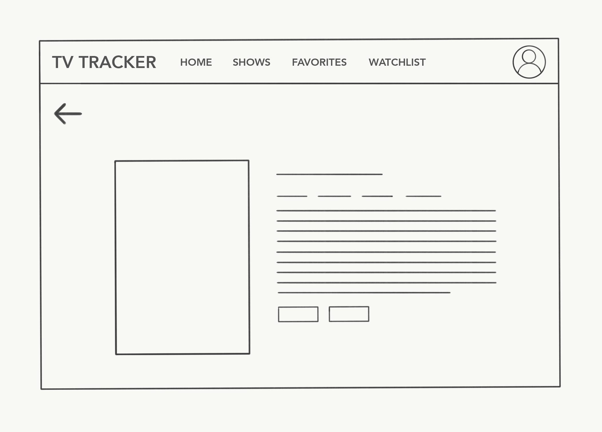
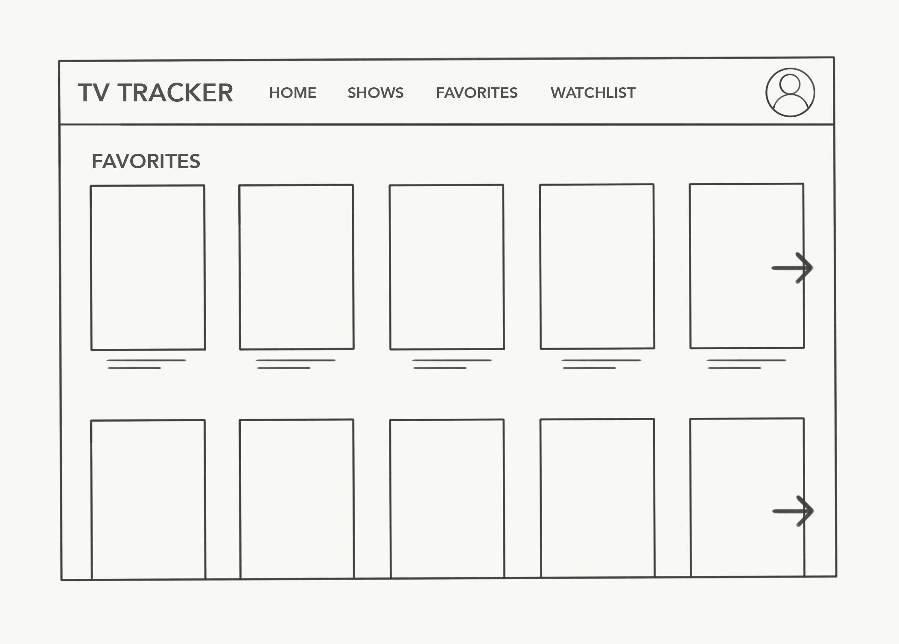
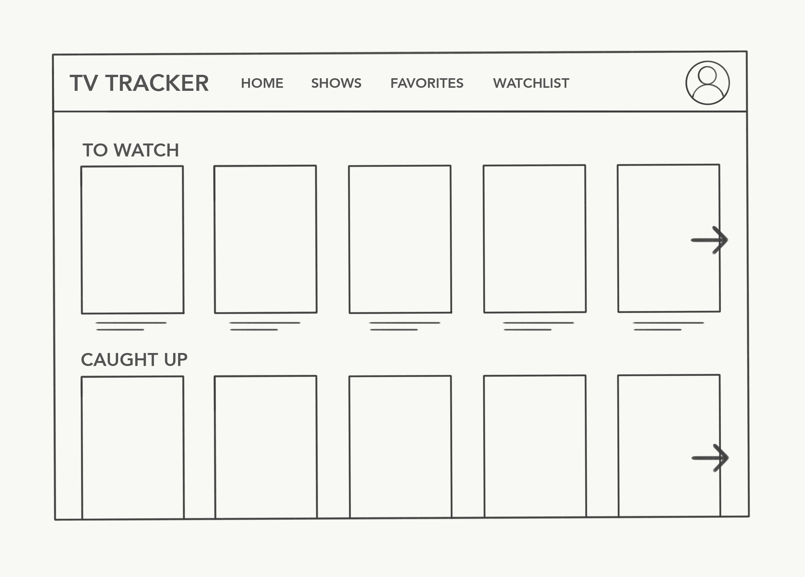
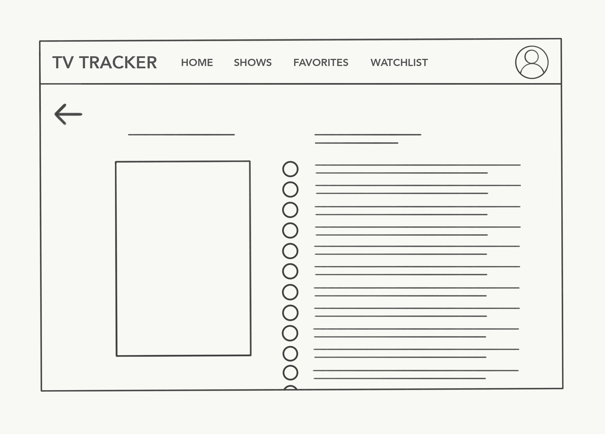

# Project 2: TV Tracker App

### Project Description:
- The project's name and description

### Wireframes:

### User Stories:
- "As a bored user, I want to	have a list of TV shows currently airing, so that I can have something to watch right now."
- "As an avid TV-show-watcher, I want to	keep track of the many shows I watch, so I can keep up to date and not fall behind."
- "As a lover of live TV, I want to	know when my favorite shows are airing, so I know when to tune in to watch them live."
- "As an in-the-know user, I want to know what the newest and most popular TV shows are, so I can be the first to tell my friends."
- "As a snobby user,	I want to watch TV shows that have been nominated for an award (Emmy, Golden Golden Globes, etc."), so I can watch critically acclaimed shows."
- "As a forgetful user, I want to be notified when my favorite shows air, so I can remember to watch them."
- "As a seen-it-all user, I want to find new shows to watch, so I can broaden my watchlist."
- "As an indecisive user, I want to have shows suggested to me that match my interests, so I don't have to spend so much time trying to choose what to watch."
- "As a crowd-follower, I want to see what the trending/most popular shows are, so I can know what show everyone else is talking about."
- "As a returning user, I want to log in and favorite the shows that I watch, so I can easily come back and see information about them."
- "As a serial binge-watcher, I want to keep track of what episode/season I'm on, so when I start watching I know exactly which episode to start next."
- "As a visual user, I want to see the tv posters of different TV shows, so I can better decide whether I want to watch the show or not."
- "As a celeb chaser, I want to be able to sort shows by actor, so I can watch shows with characters played by my favorite actors."
- "As a forgetful user, I want to read episode summaries, so I can make sure I'm watching the right episode when I forget where I left off."
- "As an organized user, I want to see upcoming episodes for the week, so I know which days my shows will be coming out."
- "As a dedicated TV enthusiast, I want to know when the next season of my favorite shows are announced, so I don't have to be in the dark about whether the show will be renewed or not."
- "As a parent, I want to look up the maturity rating for different shows, so I know whether to let my kids watch a show or not."
- "As a user with multiple streaming accounts, I want to know what shows are available on which streaming site, so I know where to find the show I want to watch."
- "As a snobby user, I want to see the IMDb and Rotten Tomatoes rating, so I can watch critically acclaimed shows."

### Technologies, APIs, Modules Used:
- The technologies, APIs, and modules you used and a description of each
- TMDb (The Movie Database) API
- Modules:
  - body-parser
  - method-override
  - express-session
  - bcrypt
  - isomorphic-fetch

### Code Snippet:
- A code snippet of a part of the app you're particularly proud of

### Future Additions:
- Any things you plan to fix or features you plan to add

### Instructions for Downloading/Running:
- Instructions for downloading the code and running it on localhost
